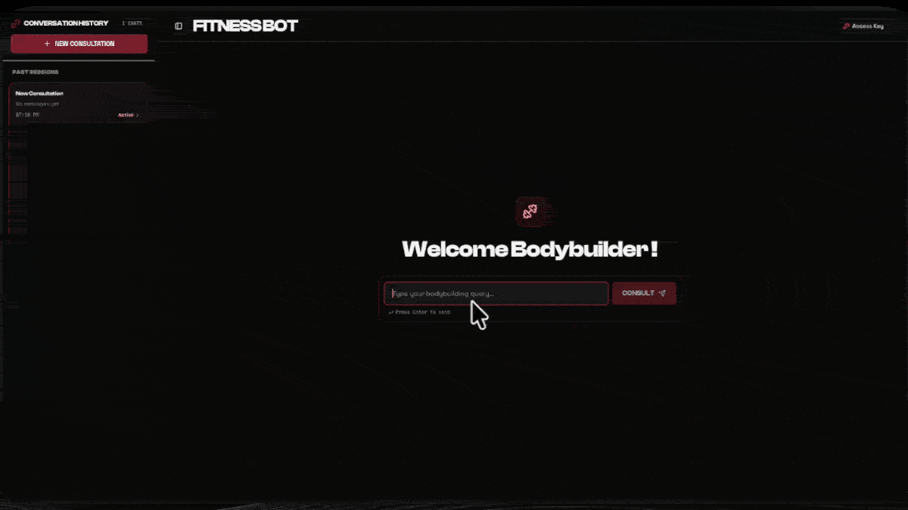
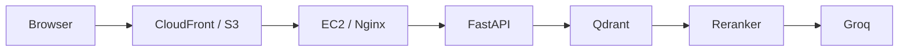

# Fitness Bot (Muscle Info RAG)



The project is deployed on AWS: [Launch Fitness Bot](https://d1kipqqm1ofiqs.cloudfront.net)

> Note: Access is password-protected to prevent unauthorized API use and stay within Groq and Qdrant Cloud free-tier rate limits.
>
> If you are reviewing this project and want access credentials, please email uzairatiq65@gmail.com or contact me on [GitHub](https://github.com/UzairAtiq) to get a guest password.

---

## Overview

A Retrieval-Augmented Generation (RAG) system with a React interface that answers bodybuilding and strength training questions grounded in Joe Weider's training course book.

General-purpose language models often hallucinate exercise routines, mix up training concepts, or answer questions outside the intended topic. Fitness Bot keeps responses grounded in Joe Weider's vintage training course by using semantic search in Qdrant Cloud, cross-encoder reranking, and explicit prompt guardrails on Groq. The application includes a password gate to protect the API and is hosted on AWS using EC2, S3, and CloudFront.

---

## Key Features

- **Markdown Document Ingestion**: Splits source text using Markdown headers (H1–H4) so chapter and exercise titles stay attached to each text chunk.
- **Dense Vector Retrieval**: Creates 384-dimensional embeddings using `sentence-transformers/all-MiniLM-L6-v2` and retrieves top candidates via cosine similarity in Qdrant Cloud.
- **Cross-Encoder Reranking**: Reranks top candidates using `cross-encoder/ms-marco-MiniLM-L-6-v2` to pick the top 2 most relevant chunks.
- **Domain Guardrails**: System prompt tells the model to reject off-topic questions and give direct exercise explanations without conversational filler.
- **Rate Limit and Error Handling**: Catches Groq 413/429 token-per-minute errors and Qdrant connection resets, returning readable status notices.
- **Password-Gated Access**: Uses timing-safe shared key checks (`secrets.compare_digest`) on `/ask` and `/verify-key` endpoints.
- **React Frontend**: Built with React, TypeScript, Vite, and Tailwind CSS with local chat history, a typewriter effect, and Markdown rendering.
- **AWS Deployment**: FastAPI backend runs on EC2 behind an Nginx HTTPS reverse proxy; static frontend is served globally through CloudFront and S3.

---

## Quick Start

**Prerequisites**: Python 3.12+, Node 18+, and API keys for [Qdrant Cloud](https://cloud.qdrant.io/) and [Groq Cloud](https://console.groq.com/).

```bash
# 1. Clone and navigate to the repository
git clone https://github.com/UzairAtiq/bodybuilding_rag.git
cd bodybuilding_rag

# 2. Create virtual environment and install requirements
python3 -m venv .venv
source .venv/bin/activate
pip install -r requirements.txt

# 3. Copy environment configuration
cp .env.example .env

# 4. Ingest course material into Qdrant (one time)
python scripts/ingest.py

# 5. Start the backend API
uvicorn app.api.routes:app --reload

# 6. Start the frontend (in a new terminal)
cd frontend && npm install && npm run dev
```

Open http://localhost:5173 in your browser and enter your `SHARED_ACCESS_KEY` in the lock screen.

### Environment Variables

Configure the required keys in `.env`:
- `QDRANT_URL`: Endpoint URL of your Qdrant Cloud cluster
- `QDRANT_API_KEY`: API key for Qdrant Cloud
- `GROQ_API_KEY`: Groq Cloud API key for model generation
- `SHARED_ACCESS_KEY`: Any password you choose locally (authenticates frontend and API requests)

*Optional*: `collection_name` (defaults to `bodybuilding_rag`) and `VITE_BACKEND_URL` in `frontend/.env` (defaults to `http://localhost:8000`).

---

## Architecture



1. Verify access key
2. Embed the question
3. Retrieve top 5 chunks from Qdrant
4. Rerank to the top 2
5. Build a guarded prompt
6. Generate the answer with Groq

---

## Tech Stack

| Layer | Technology |
| :--- | :--- |
| Frontend | React, TypeScript, Vite |
| Styling | Tailwind CSS |
| Backend API | FastAPI, Uvicorn |
| Embeddings | `sentence-transformers/all-MiniLM-L6-v2` |
| Vector Database | Qdrant Cloud (`qdrant-client`) |
| Reranker | `cross-encoder/ms-marco-MiniLM-L-6-v2` |
| LLM Inference | Groq API (`openai/gpt-oss-120b`) |
| Orchestration | LangChain Core (`langchain-core`) |
| Containerization | Docker |
| Cloud Hosting | AWS (EC2, S3, CloudFront) |

---

## API Endpoints

| Method | Endpoint | Auth Required | Request Details | Response |
| :--- | :--- | :---: | :--- | :--- |
| `GET` | `/health` | No | None | `{"status": "ok", "service": "Fitness Bot API"}` |
| `POST` | `/verify-key` | Yes | Header: `x-access-key: <key>` | `{"valid": true}` (or 401 Unauthorized) |
| `POST` | `/ask` | Yes | Header: `x-access-key: <key>`<br>JSON: `{"query": "string"}` | `{"answer": "string"}` |

### Example Request

```bash
curl -X POST "http://localhost:8000/ask" \
  -H "Content-Type: application/json" \
  -H "x-access-key: your-secret-password" \
  -d '{"query": "What exercises primarily target the triceps?"}'
```

### Example Response

```json
{
  "answer": "### Triceps Targeted Exercises\n\n- **Close-Grip Bench Press**: Places primary mechanical tension on the inner triceps heads while minimizing shoulder involvement.\n- **Triceps Extension (Lying/Standing)**: Isolates the long head of the triceps through full elbow extension."
}
```

---

## Testing and Profiling

### 1. Latency and Resource Profiling

A benchmark script is included in `tests/benchmark_pipeline.py` to measure latency across each step (MiniLM embeddings, Qdrant vector search, CrossEncoder reranking, Groq LLM call) and check CPU/RAM usage:

```bash
python tests/benchmark_pipeline.py --runs 3
```

Useful flags:
- `--runs <int>`: Number of runs to average (default: 3).
- `--query "<text>"`: Custom question to test.
- `--no-system-check`: Skips reading system CPU and RAM stats.
- `--profile-only`: Measures step timings without generating full text answers.

### 2. Qualitative Retrieval Evaluation

Runs 8 sample questions from different chapters of the source book through the pipeline:

```bash
python scripts/evaluate.py
```

Outputs are written to `data/evaluation/evaluate.json`, including the question, answer, and retrieved chunk headers with scores.

---

## Deployment

Backend runs on AWS EC2 behind Nginx. Frontend is served from S3 and CloudFront.
Docker and full AWS details: see [DEPLOYMENT.md](DEPLOYMENT.md).

---

## Folder Structure

<details>
<summary>Folder structure</summary>

```text
Muscle_Info_RAG/
├── app/
│   ├── api/
│   │   └── routes.py             # FastAPI endpoints (/ask, /verify-key, /health) and CORS
│   ├── generation/
│   │   ├── llm.py                # Groq ChatGroq client and rate-limit handlers
│   │   └── prompt.py             # Prompt template with bodybuilding domain guardrails
│   ├── ingestion/
│   │   ├── cleaner.py            # Text normalization and whitespace cleaning
│   │   ├── chunker.py            # MarkdownHeaderTextSplitter (Headers 1-4)
│   │   ├── indexer.py            # Qdrant collection setup, embedding, and upserting
│   │   └── loaders.py            # Markdown file loader
│   ├── retrieval/
│   │   ├── reranker.py           # Cross-encoder reranking model and scoring
│   │   └── retriever.py          # Qdrant client retrieval function
│   ├── config.py                 # Loads environment variables
│   └── pipeline.py               # End-to-end RAG pipeline
├── data/
│   ├── evaluation/
│   │   └── evaluate.json         # Output results from evaluation runs
│   └── raw/
│       └── joe-weider-...md      # Source course text in Markdown
├── frontend/
│   ├── src/
│   │   ├── components/           # AccessModal, Header, Sidebar, Chatbox, ChatInput, ChatMessage
│   │   ├── hooks/                # Typewriter animation hook
│   │   ├── services/             # API client connecting to FastAPI (/ask, /verify-key)
│   │   ├── types/                # Session, message, and query status types
│   │   ├── App.tsx               # Main application state and session management
│   │   └── main.tsx              # React entry point
│   ├── index.html                # HTML template with cache prevention meta tags
│   ├── package.json              # Frontend dependencies and npm scripts
│   └── vite.config.ts            # Vite build configuration and path aliases
├── scripts/
│   ├── evaluate.py               # 8-question evaluation script
│   └── ingest.py                 # Chunks, embeds, and indexes source documents
├── tests/
│   └── benchmark_pipeline.py     # Latency and memory profiling script
├── Dockerfile                    # Container configuration with pre-cached models
├── requirements.txt              # Pinned Python dependencies
├── .env.example                  # Backend environment variables template
└── README.md
```

</details>

---

## Roadmap

- Table Boundary Preservation: `MarkdownHeaderTextSplitter` splits on headers rather than table boundaries. As a result, dense workout tables with exercise lists, sets, and reps can sometimes split across chunks. Formatting tables into structured text before chunking is planned.
- Automated CI/CD: Adding a GitHub Actions workflow to build, upload to S3, and invalidate CloudFront on push.
- Unit Test Coverage: Implementing automated tests for chunking (`test_ingestion.py`), retrieval scoring (`test_retrieval.py`), and error mocks (`test_pipeline.py`) (current test files in `tests/` contain stubs only).
- Token Streaming: Adding Server-Sent Events (SSE) or WebSockets to stream Groq response tokens to the React frontend in real time.

---

## License

None 
---

## Contact

- Author: Uzair Atiq
- Email: uzairatiq65@gmail.com
