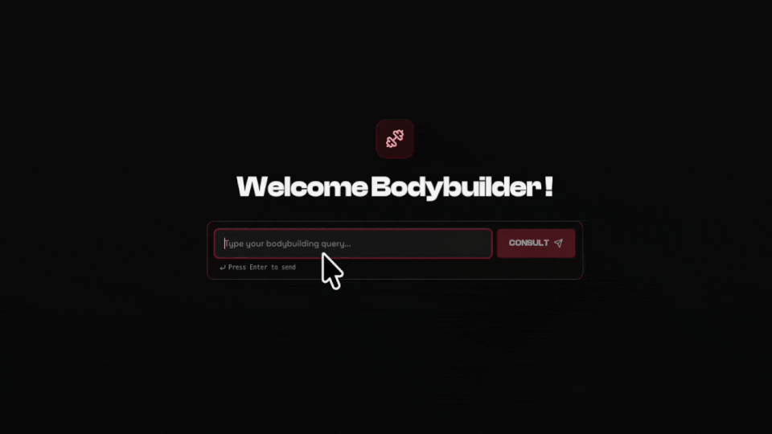
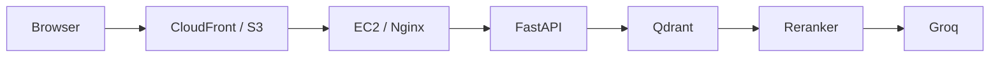

# Fitness Bot



The project is deployed on AWS: [Launch Fitness Bot](https://d1kipqqm1ofiqs.cloudfront.net)

> Note: Access is password-protected to prevent unauthorized API use and stay within Groq and Qdrant Cloud free-tier rate limits.
>
> If you are reviewing this project and want access credentials, please email uzairatiq65@gmail.com or contact me on [GitHub](https://github.com/UzairAtiq) to get a guest password.

---

## Overview

A Retrieval-Augmented Generation (RAG) system with a React interface that answers bodybuilding and strength training questions grounded in Joe Weider's training course book.

---

## Key Features

- **Markdown Document Ingestion**: Splits source text using Markdown headers (H1–H4) so chapter and exercise titles stay attached to each text chunk.
- **Dense Retrieval & Reranking**: Generates dense embeddings (`all-MiniLM-L6-v2`) in Qdrant Cloud and reranks candidates with a cross-encoder (`ms-marco-MiniLM-L-6-v2`).
- **Domain Guardrails**: System prompt rejects off-topic queries and provides direct exercise explanations without conversational filler.
- **Password-Gated Access**: Validates requests using timing-safe shared key checks (`secrets.compare_digest`) on API endpoints.
- **React Frontend & AWS Deployment**: Responsive UI with chat history and typewriter effect on S3/CloudFront, backed by FastAPI on EC2.

---

## Quick Start

**Prerequisites**: Python 3.12+, Node 18+, and API keys for [Qdrant Cloud](https://cloud.qdrant.io/) and [Groq Cloud](https://console.groq.com/).

```bash
# 1. Clone and navigate to the repository
git clone https://github.com/UzairAtiq/bodybuilding_rag.git
cd bodybuilding_rag

# 2. Create virtual environment and install requirements
python3 -m venv .venv
source .venv/bin/activate
pip install -r requirements.txt

# 3. Copy environment configuration
cp .env.example .env

# 4. Ingest course material into Qdrant (one time)
python scripts/ingest.py

# 5. Start the backend API
uvicorn app.api.routes:app --reload

# 6. Start the frontend (in a new terminal)
cd frontend && npm install && npm run dev
```

Open http://localhost:5173 in your browser and enter your `SHARED_ACCESS_KEY` in the lock screen.

Required keys: `QDRANT_URL`, `QDRANT_API_KEY`, `GROQ_API_KEY`, `SHARED_ACCESS_KEY`. See [Configuration](docs/CONFIGURATION.md).

---

## Architecture



Details: [docs/ARCHITECTURE.md](docs/ARCHITECTURE.md)

---

## Tech Stack

| Layer | Technology |
| :--- | :--- |
| Frontend | React, TypeScript, Vite |
| Styling | Tailwind CSS |
| Backend API | FastAPI, Uvicorn |
| Embeddings | `sentence-transformers/all-MiniLM-L6-v2` |
| Vector Database | Qdrant Cloud (`qdrant-client`) |
| Reranker | `cross-encoder/ms-marco-MiniLM-L-6-v2` |
| LLM Inference | Groq API (`openai/gpt-oss-120b`) |
| Orchestration | LangChain Core (`langchain-core`) |
| Containerization | Docker |
| Cloud Hosting | AWS (EC2, S3, CloudFront) |

---

## Documentation

- [API Reference](docs/API.md)
- [Testing and Profiling](docs/TESTING.md)
- [Configuration](docs/CONFIGURATION.md)
- [Architecture](docs/ARCHITECTURE.md)
- [Project Structure](docs/PROJECT_STRUCTURE.md)
- [Deployment](docs/DEPLOYMENT.md)

---

## License

None

---

## Contact

- Author: Uzair Atiq
- Email: uzairatiq65@gmail.com
