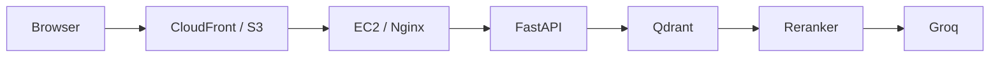

# Architecture

Overview of the end-to-end RAG pipeline, component flow, and system architecture.

## Pipeline Flow

### Request Lifecycle Steps

1. **Verify access key**: The `/ask` endpoint validates the request header via `secrets.compare_digest`.
2. **Embed the question**: Encodes the query into a 384-dimensional dense vector using `sentence-transformers/all-MiniLM-L6-v2`.
3. **Retrieve top candidates**: Queries Qdrant Cloud via cosine similarity to fetch the top 5 relevant document chunks.
4. **Rerank candidates**: Uses `cross-encoder/ms-marco-MiniLM-L-6-v2` (truncated to 1,200 characters to minimize CPU latency) to score and filter down to the top 2 chunks.
5. **Build guarded prompt**: Combines system instructions, guardrails, and retrieved course context into a structured prompt template.
6. **Generate response**: Generates a grounded answer using Groq Cloud inference (`openai/gpt-oss-120b`).

---

## Key Features (Details)

- **Markdown Document Ingestion**: Splits source text using Markdown headers (Header 1 through Header 4) so chapter and exercise titles stay attached to each text chunk.
- **Dense Vector Retrieval**: Creates 384-dimensional embeddings using `sentence-transformers/all-MiniLM-L6-v2` and retrieves top candidates via cosine similarity in Qdrant Cloud.
- **Cross-Encoder Reranking**: Reranks the top candidates using `cross-encoder/ms-marco-MiniLM-L-6-v2` (truncated to 1,200 characters to keep CPU latency low) to pick the top 2 most relevant chunks.
- **Domain Guardrails**: The system prompt tells the model to reject off-topic questions (like geography, politics, or general trivia) and give direct exercise explanations without conversational filler.
- **Rate Limit and Error Handling**: Catches Groq 413 and 429 token-per-minute errors as well as Qdrant connection resets, returning readable status notices instead of crashing.
- **Password-Gated Access**: Uses a timing-safe shared key check (`secrets.compare_digest`) on `/ask` and `/verify-key` endpoints.
- **React Frontend**: Built with React 19, TypeScript, Vite, and Tailwind CSS. Includes an access lock modal, chat history stored in `localStorage`, a typewriter effect, and Markdown rendering for workout tables and lists.
- **AWS Deployment**: The FastAPI backend runs on an EC2 instance behind an Nginx reverse proxy with HTTPS. The static frontend is hosted on S3 and delivered globally through CloudFront.
