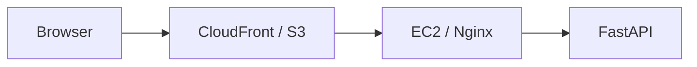

# Deployment Guide

## Overview

The application is deployed on AWS infrastructure: the FastAPI backend runs on an EC2 instance behind an Nginx reverse proxy, while the static React frontend is hosted on S3 and distributed globally through CloudFront.



---

## Backend (AWS EC2)

- **Host**: Ubuntu EC2 instance running Uvicorn on port 8000.
- **Process Manager**: Managed by `systemd` to keep the Uvicorn service running continuously and automatically restart on updates or crashes.
- **Reverse Proxy**: Nginx on port 443 with Let's Encrypt TLS certificates, proxying traffic to `http://localhost:8000` with a 90s read timeout (`proxy_read_timeout 90s;`) to handle embedding, reranking, and LLM inference.
- **CORS**: Configured in `app/api/routes.py` to allow requests from the CloudFront distribution domain (`https://d1kipqqm1ofiqs.cloudfront.net`) and local dev servers.

---

## Frontend (S3 + CloudFront)

- **Static Hosting**: Production build (`frontend/dist/`) is stored in an S3 bucket (uploaded via AWS Console after `npm run build`).
- **Global CDN**: Amazon CloudFront (`d1kipqqm1ofiqs.cloudfront.net`) distributes the static files globally.

---

## Cache Handling

- **Assets**: Files in `dist/assets/*` use content hashes in filenames (`index-COc4Hb0a.js`) and can be cached long-term.
- **HTML**: The `dist/index.html` file has S3 metadata set to `Cache-Control: no-cache, no-store, must-revalidate` along with HTML meta tags so browsers always fetch the newest build immediately.

---

## Docker (Local / Optional)

> **Note**: The AWS EC2 production deployment runs directly with Uvicorn and Nginx without containers. The Docker setup in `docker/` is provided purely for optional local development and testing.

The `docker/Dockerfile` uses a Python 3.12 slim base and downloads both model weights during the build step so containers do not download weights from Hugging Face on startup:

```bash
# Build the container image from project root
docker build -f docker/Dockerfile -t muscle-info-rag .

# Run the container with your environment file
docker run -d -p 8000:8000 --env-file .env --name fitness-bot-api muscle-info-rag
```

Check that the container is responding:

```bash
curl http://localhost:8000/health
```

---

## Planned

- **Automated CI/CD**: Adding a GitHub Actions workflow to build the frontend, upload build artifacts to S3, and invalidate CloudFront on push.
